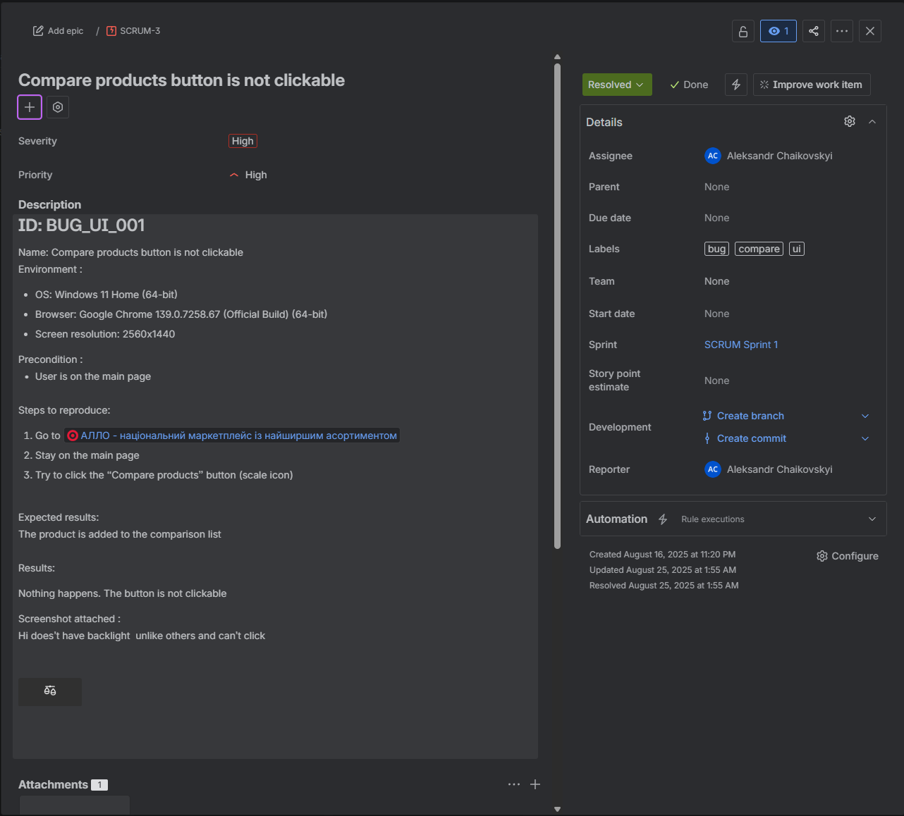
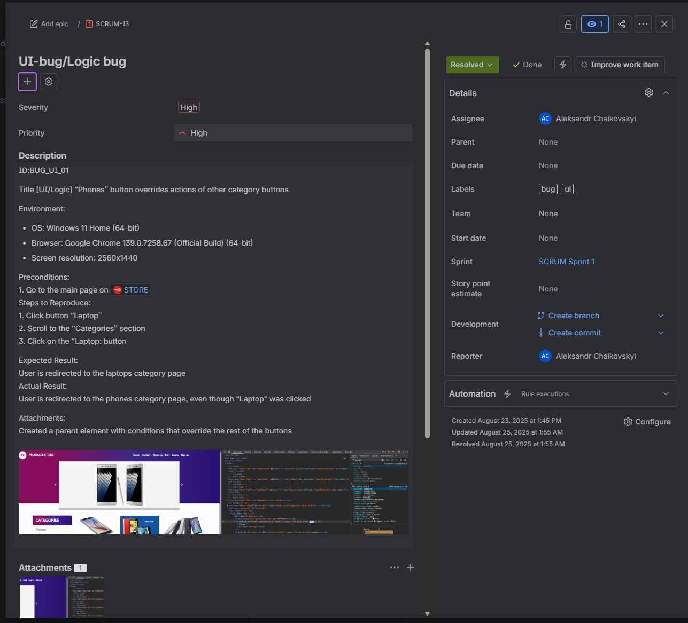
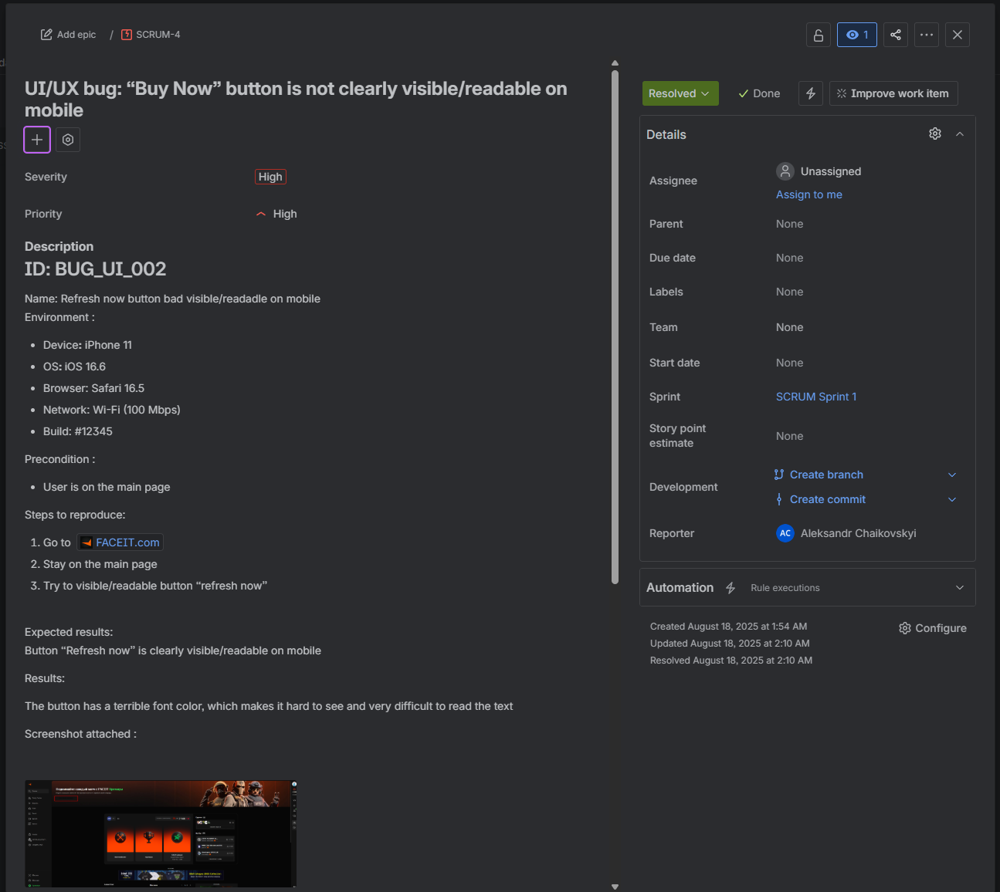
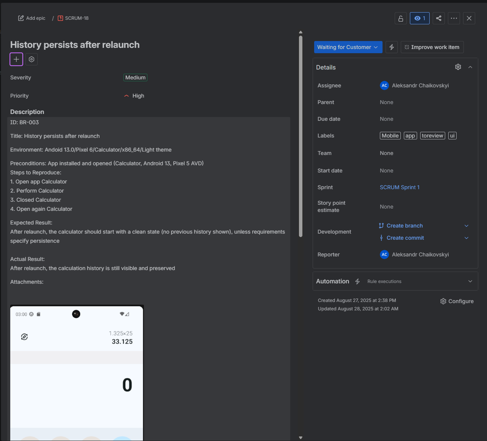

#  Bug Reports (Jira)

This folder contains examples of bug reports created and tracked in **Jira**.  
It demonstrates practical skills in bug reporting, defect lifecycle and communication with dev teams.

---

##  Bug examples

### BR-001: Compare products button is not clickable
- **Severity:** High  
- **Priority:** High  
- **Type:** UI/Functional  
- **Environment:** Windows 11, Chrome 139, 2560x1440  
- **Description:**  
  Compare button (scale icon) does not work. Clicking has no effect, product is not added to comparison list.  
- **Status:** Open  
- **Screenshot:**  

---

### BR-002: UI/Logic bug – "Phones" button overrides other category buttons
- **Severity:** High  
- **Priority:** High  
- **Type:** Logic/UI  
- **Environment:** Windows 11, Chrome 139, 2560x1440  
- **Description:**  
  Clicking "Laptop" button redirects user to "Phones" category. Parent element overrides button actions.  
- **Status:** Resolved  
- **Screenshot:**  

---

### BR-003: UI/UX bug – "Buy Now" button is not visible/readable on mobile
- **Severity:** High  
- **Priority:** High  
- **Type:** UI/UX  
- **Environment:** iPhone 11, iOS 16.6, Safari 16.5  
- **Description:**  
  "Buy Now" button has poor font color contrast → hard to see/read on mobile.  
- **Status:** Open  
- **Screenshot:**  

---

### BR-004: Mobile bug – History persists after relaunch
- **Severity:** Medium  
- **Priority:** High  
- **Type:** Mobile/UI  
- **Environment:** Android 13, Pixel 6 (AVD), Calculator app  
- **Description:**  
  After relaunch, calculator shows previous history instead of clean state.  
- **Status:** Waiting for customer / To review  
- **Screenshot:**  

---

 Each report includes:  
- Environment  
- Preconditions  
- Steps to reproduce  
- Expected vs Actual results  
- Severity & Priority  
- Screenshot attached  

This demonstrates ability to work with **Jira**, bug lifecycle, and structured defect documentation.
